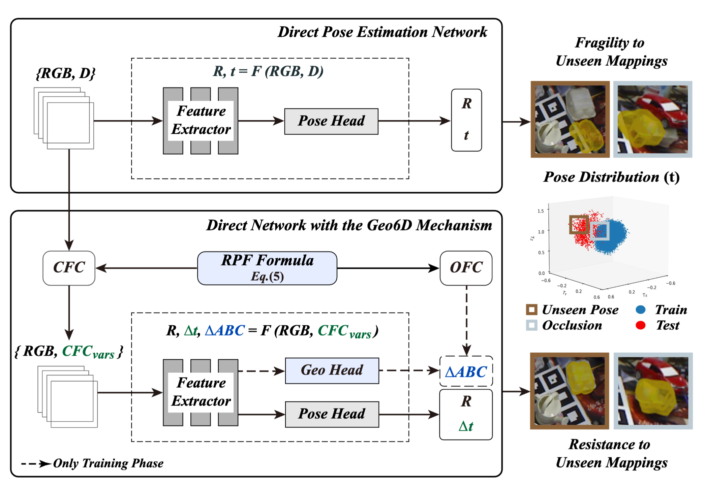

<div align="center">
<br>
<h3>Geo6D: Geometric-Constraints-Guided Direct Object 6D Pose Estimation Network</h3>

Jianqiu Chen<sup>1</sup>&nbsp;
Mingshan Sun<sup>2</sup>&nbsp;
Ye Zheng<sup>3</sup>&nbsp;
Tianpeng Bao<sup>2</sup>&nbsp;
<br>
Zhenyu He<sup>1</sup>&nbsp;
Donghai Li<sup>2</sup>&nbsp;
Guoqiang Jin<sup>2</sup>
Zhao Rui<sup>2</sup>&nbsp;
Liwei Wu<sup>2</sup>&nbsp;
Xiaoke Jiang<sup>4</sup> 

<sup>1</sup> Harbin Institute of Technology, Shenzhen &nbsp; <sup>2</sup> SenseTime Research&nbsp; <sup>3</sup> JD.com, Inc&nbsp; <sup>4</sup> International Digital Economy Academy (IDEA)&nbsp;


  
</div>

## Abstract
Direct pose estimation networks aim to directly regress the 6D poses of target objects in the scene image by the neural network. These direct methods offer efficiency and an optimal optimization target, presenting significant potential for practical applications.
However, due to the complex and implicit mappings between input features and target pose parameters, these direct methods are challenging to train and prone to overfitting on seen mappings during training, resulting in limited effectiveness and generalization capability on unseen mappings. 
Existing methods primarily focus on network architecture and training strategies, with less attention given to the aspect of mappings.
In this work, we propose a geometric constraints learning approach, which enables networks to explicitly capture and utilize the geometric mappings between inputs and optimization targets for pose estimation.
Specifically, we introduce a residual pose transformation formula that preserves pose transformation constraints within both the 2D image plane and the 3D space while decoupling absolute pose distribution, thereby addressing the pose distribution gap issue. 
We further design a Geo6D mechanism based on the formula, which enables the network to explicitly utilize geometric constraints for pose estimation by reconstructing the inputs and outputs.
We select two different methods as our baseline and extensive experiments show that Geo6D brings a performance boost and reduces dependency on extensive training data, remaining effective even with only 10\% typical data volume.


## Core Code

Our primary contribution is to integrate the geometric constraints into the end-to-end pose regression network. Here is the core code showing how Geo6D processes input and output data. Below are key code snippets from `datasets/ycb/geo6d_data_processing.py`:

```python
def geo6d_reconstruct(xyz, mask, R=None, t=None):
    """
    reconstruct the input following the paper Geo6D
    xyz: [H, W, 3] 3D coordinates of the points in the camera frame calculated from depth
    mask: [H, W] valid mask
    R: [3, 3] rotation matrix (for training)
    t: [3] translation vector (for training)
    """

    # reference point generation
    depth_mask_xyz = xyz * mask[:, :, np.newaxis]
    choose = depth_mask_xyz[:, :, 2].flatten().nonzero()[0]
    mask_x = xyz[:, :, 0].flatten()[choose][:, np.newaxis]
    mask_y = xyz[:, :, 1].flatten()[choose][:, np.newaxis]
    mask_z = xyz[:, :, 2].flatten()[choose][:, np.newaxis]
    mask_xyz = np.concatenate((mask_x, mask_y, mask_z), axis=1)

    t_0 = mask_xyz.mean(axis=0).reshape(3)
    x_0, y_0, d_0 = t_0
    x_i, y_i, d_i = mask_xyz[:, 0], mask_xyz[:, 1], mask_xyz[:, 2]
    normalized_xyz = (mask_xyz - t_0.reshape((-1, 3)))

    # reconstruct input
    delta_u = x_i / d_i - x_0 / d_0
    delta_v = y_i / d_i - y_0 / d_0
    delta_d = d_i - d_0
    depth_d_d_0 = d_i * d_0
    t_0_depth = t_0.reshape(1, 3) / depth_d_d_0.reshape(-1, 1)

    input_data_valid = np.concatenate([delta_u.reshape(-1, 1), delta_v.reshape(-1, 1),
                                      delta_d.reshape(-1, 1), depth_d_d_0.reshape(-1, 1), t_0_depth], axis=-1)

    H, W = mask.shape
    input_data = np.zeros((H*W, input_data_valid.shape[-1]))
    input_data[choose, :] = input_data_valid
    input_data = input_data.reshape(H, W, -1)

    # reconstruct optimization targets
    if R is not None and t is not None:
        abc_i = np.matmul(mask_xyz - t.reshape(-1, 3), R)
        abc_0 = np.matmul(t_0.reshape(-1, 3) - t.reshape(-1, 3), R)
        delta_abc = abc_i / d_i.reshape(-1, 1) - abc_0 / d_0.reshape(1, 1)
        delta_t = t - t_0
        delta_abc_target = np.zeros((H*W, 3))
        delta_abc_target[choose, :] = delta_abc
        delta_abc_target = delta_abc_target.reshape(H, W, -1)
    else:
        delta_abc_target = delta_t = None

    target_data = {'R': R, 't': delta_t,
                   'centroid': t_0, 'delta_abc_target': delta_abc_target}

    return input_data, target_data
```


## Getting Started
### Set up the environment:
```
pip3 install -r requirements.txt
```

### Prepare the dataset:
Download the YCB-Video dataset from [here](https://utdallas.app.box.com/s/r5sx2ghgn62bg1tgjp9ily6jx2fifahl).

Unzip the downloaded YCB-Video dataset and place it in the `datasets/ycb/data` directory with the following structure:
```
datasets/
└── ycb/
    ├── data/
    │   ├── 0000/
    │   │   ├── 000001-box.txt
    │   │   ├── 000001-color.png
    │   │   ├── 000001-depth.png
    │   │   ├── 000001-label.png
    │   │   └── 000001-meta.mat
    │   │   └── ...
    │   ├── 0001/
    │   │   ├── 000001-box.txt
    │   │   ├── 000001-color.png
    │   │   ├── 000001-depth.png
    │   │   ├── 000001-label.png
    │   │   └── 000001-meta.mat
    │   │   └── ...
    │   └── ...
    ├── data_syn/
    │   ├── 000000-color.png  
    │   ├── 000000-depth.png  
    │   ├── 000000-label.png  
    │   └── 000000-meta.mat
    │   └── ...
    └── dataset_config/
    │    ├── train_list.txt
    │    └── test_list.txt
    ├── ycb_models/
    │   ├── 002_master_chef_can/
    │   │   ├── textured.pcd
    │   ├── 003_cracker_box/
    │   │   ├── textured.pcd
    │   ├── 004_sugar_box/
    │   │   ├── textured.pcd
    │   └── ...
```

### Train the model without Geo6D:
```
# 10% of the training data
python3 main.py --train_list_name train_list_10p.txt --exp_name baseline_10p

# 100% of the training data
python3 main.py --train_list_name train_list.txt --exp_name baseline_100p

```

### Train the model with Geo6D:
```
# 10% of the training data
python3 main.py --train_list_name train_list_10p.txt --geo6d_mode --exp_name geo6d_10p

# 100% of the training data
python3 main.py --train_list_name train_list.txt --geo6d_mode --exp_name geo6d_100p
```

### Evaluate the model
Evaluate the model without Geo6D
```
# 10% of the training data
python3 main.py --test --resume checkpoint_0029.pth.tar --exp_name baseline_10p

# 100% of the training data
python3 main.py --test --resume checkpoint_0029.pth.tar --exp_name baseline_100p
```

Evaluate the model with Geo6D
```
# 10% of the training data
python3 main.py --test --resume checkpoint_0029.pth.tar --exp_name geo6d_10p

# 100% of the training data
python3 main.py --test --resume checkpoint_0029.pth.tar --exp_name geo6d_100p
```
